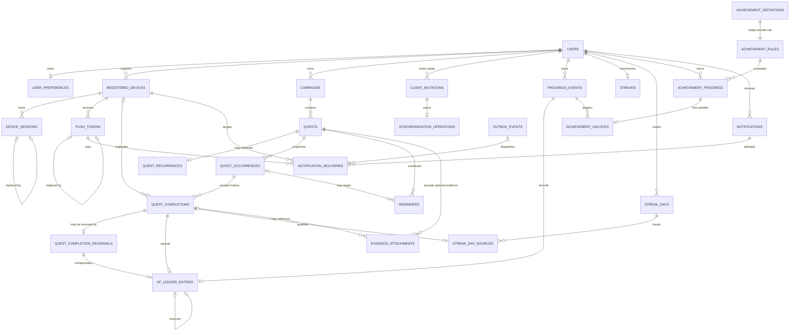

# Stage 3 database schema

This document records the PostgreSQL schema created by Stage 3 issues #37–#64.
It implements the Stage 1 product rules without adding authentication, API,
worker, notification-delivery, upload, or synchronization behavior.

## Authority and storage conventions

- PostgreSQL stores authoritative identity, ownership, lifecycle, and audit data.
- Primary identifiers are application-generated UUIDs; no PostgreSQL extension is
  required for clean installation.
- Instants use timezone-aware timestamps. Local calendar dates and IANA timezone
  names are stored separately where later domain logic requires them.
- State values are stable lowercase strings protected by named checks.
- Record versions and event-sequence allocators are backend-owned positive integers.
- Ordinary deletion must not erase historical or reward-bearing data. Explicit
  foreign-key behavior is listed with each relationship.
- Structured private values are minimized. Database storage does not make a field
  safe for logs or public serialization.

## Identity and device tables

### `users` (#37)

Purpose: authoritative account identity and per-user event-sequence allocation.

- Primary key: `id` UUID.
- Identity: unique `canonical_email`; the database requires lowercase, trimmed,
  nonblank input containing `@`. `display_email` remains separate and trimmed.
- Lifecycle: `account_state` is `active`, `deactivated`, or `deletion_pending`;
  optional lifecycle timestamps preserve later workflow context.
- Integrity: `record_version >= 1`; `next_event_sequence >= 1`.
- Deletion: no child history cascades from ordinary user deletion. The coordinated
  account-erasure workflow remains later work.
- Sensitive classification: account identifier and email are private personal data.
  No password, access token, refresh token, or credential is stored here.

Complete email-address validation and the accepted authentication policy remain
application work. Stage 3 does not choose password rules or token lifetimes.

### `user_preferences` (#38)

Purpose: one authoritative preference snapshot per user.

- Primary key and foreign key: `user_id` → `users.id`; one row per user.
- Timezone: defaults to `UTC`; a shape check excludes abbreviations and fixed
  offsets while allowing IANA-style names. Full timezone-database validation is
  application logic.
- Versioning: positive timezone and record versions plus a server-effective instant.
- Notifications: `unspecified`, `enabled`, or `disabled`; this preference does not
  represent or require OS notification permission.
- Deletion: `ON DELETE CASCADE` because this nonhistorical snapshot has no meaning
  without its user. Coordinated account deletion is still required for the rest of
  the graph.

### `registered_devices` (#39)

Purpose: revocable, auditable application-installation context; never proof of
identity or progression authority.

- Primary key: `id` UUID; immutable `user_id` references `users` with `RESTRICT`.
- Ownership keys: unique `(id, user_id)` and
  `(id, user_id, platform, app_environment)` support composite child references.
- Platform/environment: `android` or `ios`; `development`, `preview`, or
  `production`.
- Lifecycle: `active`, `revoked`, or `removed`, with timestamp consistency checks.
- Active uniqueness: partial unique index on
  `(user_id, app_environment, installation_id)` where state is `active`.
- Query index: `(user_id, device_state, last_seen_at)`.
- Sensitive classification: installation identifiers and version metadata are
  private device metadata. Advertising IDs, IMEI, serial numbers, and hardware IDs
  are not stored.

### `device_sessions` (#40)

Purpose: revocable session metadata associated with the correct user and device;
no token issuance or refresh behavior.

- Primary key: `id` UUID; unique `(id, user_id)` supports replacement history.
- Ownership: composite `(device_id, user_id)` references registered devices with
  `RESTRICT`; a cross-user device/session link is impossible.
- Credential storage: optional opaque binary `credential_digest`; raw access and
  refresh tokens are forbidden.
- Lifecycle: `active`, `revoked`, `expired`, or `replaced`; expiration must follow
  creation and replacement/revocation timestamps must agree with state.
- Replacement: same-user self-reference retains an auditable chain.
- Query indexes: `(user_id, device_id, session_state)` and active expirations.
- Sensitive classification: credential digests, revocation data, and session times
  are private security metadata and must not enter logs or public responses.

Token lifetime, rotation, reuse detection, and maximum-device policy remain blocked
on later accepted authentication decisions.

### `push_tokens` (#41)

Purpose: private, revocable push-provider associations; never progression authority.

- Primary key: `id` UUID; unique `(id, user_id, device_id)` supports auditable
  replacement and later delivery ownership.
- Ownership: `(device_id, user_id, platform, app_environment)` must match one
  registered device; all relationships use `RESTRICT`.
- Providers: `expo`, `fcm`, or `apns`; platform and environment use the registered
  device vocabulary.
- Sensitive value: `token_value` is explicitly marked sensitive in model metadata.
  No encryption infrastructure exists, so Stage 3 does not falsely label it
  encrypted and does not implement homegrown encryption. `token_hash` supports safe
  lookup and active uniqueness.
- Lifecycle: `active`, `invalidated`, or `replaced`, with explicit timestamps and
  replacement linkage.
- Active uniqueness: provider/environment/token hash is globally unique; one active
  provider/environment association exists per user/device.
- Query index: `(user_id, device_id, token_state)`.

Raw push tokens must never appear in logs, model representations, error messages,
notification payload audit, or public API models. Encryption-at-rest integration is
deferred until a repository-approved key-management boundary exists.

## Campaign, quest, occurrence, and completion tables

### `campaigns` (#42)

Purpose: immutable-owner objective and current backend-derived lifecycle snapshot.

- Primary key: `id` UUID; `(id, user_id)` is a composite ownership key.
- Ownership: `user_id` references users with `RESTRICT`.
- Content/order: trimmed nonblank title and nonnegative display order.
- Lifecycle: `active`, `completed`, or `archived`; completed and archived states
  require their authoritative timestamps. Completion reason, archive/restore time,
  record version, and a later-work tombstone are retained.
- Query indexes: active campaigns by user/display order and archived campaigns by
  user/archive time, both as partial indexes.
- Deletion: ordinary product deletion means archive. Relationships to definitions
  and history use `RESTRICT`.

The database cannot decide the campaign-completion predicate. Later transactional
domain logic must derive state and append the corresponding progress event.

### `quests` (#43)

Purpose: immutable campaign-bound one-time or recurring quest definition.

- Primary key: `id` UUID; `(id, user_id, campaign_id, quest_type)` supports owned
  child references and prevents cross-user/cross-campaign attachment.
- Ownership: `(campaign_id, user_id)` references campaigns with `RESTRICT`.
- Type/state: `one_time` or `recurring`; definition state is only `active` or
  `archived`. There is no recurring-definition `completed` value.
- Reward/order: integer `reward_xp >= 0` and nonnegative display order.
- One-time scheduling: optional resolved availability/due instants and timezone;
  recurring definitions cannot populate these columns.
- Lifecycle: archive/restore timestamps, positive record version, and a later-work
  tombstone. Owner and campaign immutability require service-layer update rules.
- Query index: `(user_id, campaign_id, definition_state, display_order)`.
- Evidence: no evidence-required or evidence-validation field exists.

### `quest_recurrences` (#44)

Purpose: exactly one MVP recurrence rule for one recurring definition.

- Primary key: `quest_id`; composite FK includes user, campaign, and the enforced
  `recurring` quest type.
- Grammar: `daily`; `weekly` with a nonempty subset of weekdays 1–7; or `monthly`
  with one day 1–31. No cron, interval, multiple-daily-time, or yearly columns exist.
- Window: inclusive start date; optional inclusive end date or positive maximum
  occurrence count, never both.
- Time: local scheduled time, IANA-shaped timezone, positive rule version, and
  server timestamps.
- Query index: user/timezone/start date supports bounded future generation work.
- Deletion: `RESTRICT`; archive controls generation without deleting the rule.

Full IANA-zone existence, DST resolution, strict weekday de-duplication, and
activation validation remain deterministic backend logic.

### `quest_occurrences` (#45)

Purpose: authoritative per-instance schedule, timezone, rule, and reward snapshot.

- Primary key: `id` UUID; `(id, user_id)` is the completion ownership target.
- Ownership: composite quest/user/campaign/type FK uses `RESTRICT`.
- State: `scheduled`, `available`, `completed`, `reversed`, `expired`, or `voided`,
  with required transition timestamps for historical states.
- Identity: recurring partial unique index on `(quest_id, occurrence_local_date)`;
  one-time partial unique index on `quest_id`.
- Snapshots: authoritative local date, optional local time, IANA timezone,
  timezone-data version, rule version, resolved UTC availability, optional expiry,
  nonnegative reward XP, and generation time.
- Query indexes: scheduled availability, available expiry, user/local-date lookup,
  and quest history.
- Deletion: `RESTRICT`; expired, voided, completed, and reversed rows remain history.

Checks preserve snapshot shape but cannot make those columns immutable or stop a
future occurrence from being completed. Later services must use allowed transitions
and treat snapshot columns as write-once.

### `quest_completions` and `quest_completion_reversals` (#46)

Purpose: retained accepted-completion history plus a separate append-only reversal
event. A reversal never deletes its completion.

- Completion primary key: `id` UUID; composite key includes user and occurrence.
- Ownership: occurrence/user and optional device/user FKs use `RESTRICT`.
- Authority: first server receipt, optional processed time, backend effective local
  date, optional device-observed metadata, client-time validity, and positive event
  sequence are stored separately.
- Active identity: partial unique index on `occurrence_id` where `reversed_at` is
  null. After a transaction records a unique reversal and sets `reversed_at`, a
  fresh completion row may become active while all prior history remains.
- Replay support: optional per-user client mutation is unique within completion or
  reversal history until the global mutation binding is added by #47.
- Reversal: stable UUID, owner, occurrence, unique target completion, optional
  originating device/mutation, nonblank reason, server timestamps, and event
  sequence. All relationships use `RESTRICT`.
- Query indexes: completion effective-date/history and reversal receipt history.
- Sensitive classification: optional device times/timezones are private metadata;
  no evidence, credential, or unrestricted request payload is stored.

The completion row's `reversed_at`, occurrence state transition, reversal insertion,
future XP compensation, and progress event must occur in one transaction. Ordinary
constraints cannot require the matching child reversal while permitting insertion
order, so later service logic and Stage 3 transaction tests cover that invariant.

### `client_mutations` (#47)

Purpose: durable per-user idempotency binding for exact replay.

- UUID primary key; unique `(user_id, client_mutation_id)` and composite ownership
  key `(id, user_id)`.
- Stores canonical payload hash, operation/target identity, explicit processing
  state, canonical result identity, safe error class, and server timestamps.
- Composite FKs bind completion, reversal, progress, and synchronization records to
  the same user. `RESTRICT` preserves replay history.
- A partial unfinished-processing index supports recovery. Payload hashes, not raw
  private payloads, make mutation-ID reuse with different content detectable.

### `synchronization_operations` (#48)

Purpose: auditable retry state for a later synchronization worker.

- UUID primary key; one row per user/client mutation.
- Composite FKs enforce matching user, registered device, and mutation ownership.
- Explicit states distinguish pending, leased, successful, retryable, permanent,
  and cancelled outcomes. Checks enforce nonnegative attempts, in-flight leases,
  successful timestamps, and positive expected versions.
- Partial indexes support due work and stale-lease recovery; no credentials or
  evidence payloads are stored.

### `progress_events` (#49)

Purpose: append-only authoritative progression event log.

- UUID primary key; unique per-user event sequence and stable
  `(user, event type, source type, source id)` identity.
- Optional mutation binding is ownership-safe. Server receipt/processing times,
  backend effective date, rule version, and object-shaped safe JSON metadata are
  retained.
- The unique user-sequence index and source index support ordered replay and
  provenance lookup.
  Arbitrary client-authored events and secret rule bodies are application-forbidden.

### `xp_ledger_entries` (#50)

Purpose: immutable XP awards and exact compensating reversals.

- UUID primary key; composite ownership FKs bind the user to a completion or
  reversal, progress event/sequence, optional mutation, and source award.
- Award rows require nonnegative XP and a completion. Compensation rows require a
  reversal and exactly negate the referenced award amount; the composite self-FK
  proves that amount matches the retained source row.
- Partial unique indexes permit one award per completion and one compensation per
  reversal/source award. Progress event and user sequence are also unique.
- Zero-XP awards are valid. Authoritative XP is `sum(xp_delta)`. Preventing a
  negative aggregate total requires locking and validation in the future domain
  transaction because ordinary row checks cannot constrain a cross-row sum.

### `level_definitions` (#51)

Purpose: backend-owned, versioned level-curve thresholds.

- Composite primary key `(curve_version, level_number)`; thresholds are unique per
  curve. Versions and levels are positive, thresholds nonnegative, and level 1 is 0.
- Explicit draft/active/retired state and timestamps preserve activation history.
- Before activation, backend transaction logic must verify levels are contiguous
  from 1 and thresholds strictly increase (using ordered `lag`/row-number
  validation). Active curves are application-immutable. No product thresholds are
  seeded by Stage 3.

### `streaks`, `streak_days`, and `streak_day_sources` (#52)

Purpose: reconstructable user-global daily streaks with a derived summary.

- `streaks` is one row per user with nonnegative current/longest values, a last
  qualifying date, calculation watermark, and record version.
- `streak_days` has UUID identity plus unique `(user_id, effective_local_date)`.
  It snapshots server-derived date, IANA timezone and preference version. Credited
  days require at least one source; removed days retain their timestamps and row.
- `streak_day_sources` binds each completion, user, and effective date to its day;
  a unique completion source prevents duplicate credit. Optional reversal ownership
  and state preserve removal history.
- The unique user/date index and day/state index support recalculation. Multiple completions can
  share one day, including zero-XP completions. Reversing one source leaves the day
  credited while another active source remains. Source counts and summary values
  must change with source state in one future backend transaction.

### `achievement_definitions` (#53)

Purpose: versioned backend-owned achievement identity and safe presentation data.

- UUID primary key; stable internal key/rule version is unique, with composite
  version/model keys for rule and unlock integrity.
- Visibility is `visible`, `progress_hidden`, or `secret`; progress models are the
  bounded deterministic Stage 1 set. Threshold shape, nonblank public fields,
  positive rule version, and activation lifecycle are constrained.
- Hidden/secret progress exposure is forbidden. Locked secret definitions store
  only fixed generic localization keys; their real metadata is returned only after
  later authenticated unlock checks. No executable criteria are public columns.
- Active visibility lookup is partially indexed. Definition activation and
  retirement use timestamps; activated versions are application-immutable.

### `achievement_rules` (#54)

Purpose: private structured evaluation rules separated from presentation metadata.

- UUID primary key; exactly one row per definition/rule version. A composite FK
  also requires its rule model to match the definition progress model.
- Object-shaped rule configuration, a nonempty authoritative-event input array,
  positive schema version, integrity hash, and activation timestamp are retained.
- Configuration, event inputs, and integrity hash are marked sensitive. They are
  backend-only and must be validated against a model-specific schema; Python/SQL
  source, client expressions, and other executable bodies are forbidden.
- All references use `RESTRICT`; ordinary definition removal cannot erase rules.

### `achievement_progress` (#55)

Purpose: mutable, backend-derived per-user state for one rule version.

- UUID primary key; unique `(user_id, achievement_definition_id, rule_version)` and
  a composite ownership key for unlocks.
- Composite FKs require an existing matching rule model and enforce that the last
  evaluated progress event/sequence belongs to the same user.
- Nonnegative typed current value, object-shaped narrowly scoped state, explicit
  satisfied/unsatisfied state and timestamp, positive record version, and server
  timestamps are constrained.
- User/satisfaction and definition/satisfaction indexes support collection and
  reconciliation work. Reversal may lower locked/current progress; no client field
  is authoritative.

### `achievement_unlocks` (#56)

Purpose: immutable first-satisfaction history that never relocks.

- UUID primary key; unique `(user_id, achievement_definition_id, rule_version)` and
  per-user unlock sequence prevent duplicate evaluation results.
- Composite FKs bind the unlock to matching user progress, definition version, and
  triggering authoritative progress event/sequence. All delete behavior is
  `RESTRICT`.
- Authoritative unlock/creation timestamps and user/definition history indexes are
  retained. Presentation claims remain separate and are not implemented here.
- Later progress reduction or reversal never updates or deletes this row.

### `notifications` (#57)

Purpose: user-owned notification intent and in-app presentation history.

- UUID primary key and composite user key; stable per-user type/source identity
  prevents duplicate intent rows.
- Typed literal/localized content, object-shaped parameters, privacy classification,
  availability, and unread/read/dismissed/archived timestamps are constrained.
- Secret records require fixed generic lock-screen localization keys. Deep links use
  a small route/UUID pair rather than an arbitrary URI. Notifications never award
  progression and permission denial does not affect their source event.
- User/state/availability and provenance indexes support inbox retrieval.

### `notification_deliveries` (#58)

Purpose: append-only push delivery-attempt audit history.

- UUID primary key; composite FKs require notification, device, push token, provider,
  outbox event, and user ownership to agree.
- Attempt identity is unique per notification/device/channel/number. Positive
  attempts, explicit lifecycle states, ordered timestamps, nonblank safe failure
  classes, and provider-safe receipt IDs are constrained.
- Provider receipts are partially unique; notification-attempt and user-state
  indexes support audit queries. Raw provider responses, credentials, and raw token
  values are not columns. Invalid-token outcomes retain every earlier attempt.

### `reminders` (#59)

Purpose: timezone-aware reminder definitions without scheduler behavior.

- UUID primary key; composite quest/user and optional occurrence/user/quest FKs
  prevent cross-owner or cross-quest scheduling.
- Typed reminder kind, local time, IANA-shaped zone, timezone-preference version,
  enabled state, next due instant, record version, and disabled/deleted timestamps
  are retained.
- Partial unique indexes prevent duplicate occurrence and definition schedules;
  partial due and user-state indexes support a later scheduler. Reminder rows have
  no completion or progression authority.

### `evidence_attachments` (#60)

Purpose: private object-storage metadata; PostgreSQL stores no file bytes.

- UUID primary key; composite quest, optional occurrence, and optional completion
  FKs enforce one user and matching ancestry. A completion requires an occurrence.
- Provider/storage key is globally unique and never reused, while digest lookup is
  intentionally nonunique so the same content can support distinct evidence rows.
- Safe filename, media type, nonnegative byte size, minimum digest length, explicit
  upload/processing state, timestamps, and object-shaped narrow metadata are
  constrained. Storage key and metadata are marked sensitive.
- User/quest/state, occurrence, and digest indexes support private lifecycle queries.
  Uploads, device permissions, signed URLs, and mandatory evidence are out of scope.

### `outbox_events` (#61)

Purpose: transactional publication state written with a future source-domain change.

- UUID is the stable event identity; optional user scope uses `RESTRICT`. Aggregate
  and event type, object payload, positive schema version, availability, state,
  attempts, lease, publication, and safe failure metadata are retained.
- Top-level credential, password-hash, push-token, private-rule, and evidence-content
  keys are rejected. Future producers must additionally use recursively validated
  event allowlists; arbitrary nested JSON is never assumed safe.
- Partial due and stale-lease indexes plus aggregate history support deterministic
  worker polling. Published rows remain audit history. No worker or Beat schedule is
implemented by Stage 3.

## Final integrity audit (#62)

Revision `20260731_0062` closes the whole-schema integrity audit without changing
the data model. It rebuilds six IANA-timezone shape checks using PostgreSQL's
supported regular-expression syntax on `user_preferences`, `quests`,
`quest_recurrences`, `quest_occurrences`, `quest_completions`, and `streak_days`.
Full timezone-database membership and DST resolution remain backend logic.

PostgreSQL does not automatically index referencing foreign-key columns. The audit
therefore adds 17 join/restriction-support indexes whose leftmost columns were not
already covered by a useful index:

- achievement progress last-event, unlock progress, and unlock source-event;
- replacement links for sessions and push tokens;
- evidence completion ancestry;
- delivery device, outbox, and push-token ancestry;
- outbox user scope and progress-event mutation lookup;
- completion and completion-reversal device ancestry;
- reminder occurrence ownership and streak-source reversal ancestry;
- synchronization device lookup and XP-ledger mutation lookup.

The audit intentionally adds no speculative indexes. PostgreSQL inspection found
no duplicate index definitions. Invariants that need multi-row locking or domain
evaluation—event-sequence allocation, recurrence generation, mutation payload
comparison before replay, reward transactions, append-only write roles, recursive
outbox allowlists, and coordinated privacy erasure—remain future backend/service
responsibilities and are not falsely represented as ordinary checks.

## Current entity relationships

## Deletion behaviour matrix (#63)

Every Stage 3 FK declares `ON DELETE`. Preferences are the only nonhistorical
dependent record that cascades with its user. All other relationships restrict
ordinary deletion so ownership, security, reward, notification, evidence, and audit
history cannot be silently orphaned or erased.

| Child | Parent | Child relationship columns | On delete |
|---|---|---|---|
| `achievement_rules` | `achievement_definitions` | `achievement_definition_id, rule_version, rule_model` | `RESTRICT` |
| `campaigns` | `users` | `user_id` | `RESTRICT` |
| `client_mutations` | `users` | `user_id` | `RESTRICT` |
| `notifications` | `users` | `user_id` | `RESTRICT` |
| `outbox_events` | `users` | `user_id` | `RESTRICT` |
| `registered_devices` | `users` | `user_id` | `RESTRICT` |
| `streak_days` | `users` | `user_id` | `RESTRICT` |
| `streaks` | `users` | `user_id` | `RESTRICT` |
| `user_preferences` | `users` | `user_id` | `CASCADE` |
| `device_sessions` | `registered_devices` | `device_id, user_id` | `RESTRICT` |
| `device_sessions` | `device_sessions` | `replaced_by_session_id, user_id` | `RESTRICT` |
| `progress_events` | `client_mutations` | `user_id, client_mutation_id` | `RESTRICT` |
| `progress_events` | `users` | `user_id` | `RESTRICT` |
| `push_tokens` | `registered_devices` | `device_id, user_id, platform, app_environment` | `RESTRICT` |
| `push_tokens` | `push_tokens` | `replaced_by_push_token_id, user_id, device_id` | `RESTRICT` |
| `quests` | `campaigns` | `campaign_id, user_id` | `RESTRICT` |
| `synchronization_operations` | `registered_devices` | `device_id, user_id` | `RESTRICT` |
| `synchronization_operations` | `client_mutations` | `user_id, client_mutation_id` | `RESTRICT` |
| `achievement_progress` | `progress_events` | `last_progress_event_id, user_id, last_event_sequence` | `RESTRICT` |
| `achievement_progress` | `achievement_rules` | `achievement_definition_id, rule_version, progress_model` | `RESTRICT` |
| `achievement_progress` | `users` | `user_id` | `RESTRICT` |
| `notification_deliveries` | `registered_devices` | `device_id, user_id` | `RESTRICT` |
| `notification_deliveries` | `notifications` | `notification_id, user_id` | `RESTRICT` |
| `notification_deliveries` | `outbox_events` | `outbox_event_id, user_id` | `RESTRICT` |
| `notification_deliveries` | `push_tokens` | `push_token_id, user_id, device_id, provider` | `RESTRICT` |
| `quest_occurrences` | `quests` | `quest_id, user_id, campaign_id, quest_type` | `RESTRICT` |
| `quest_recurrences` | `quests` | `quest_id, user_id, campaign_id, quest_type` | `RESTRICT` |
| `achievement_unlocks` | `achievement_definitions` | `achievement_definition_id, rule_version` | `RESTRICT` |
| `achievement_unlocks` | `achievement_progress` | `achievement_progress_id, user_id, achievement_definition_id, rule_version` | `RESTRICT` |
| `achievement_unlocks` | `progress_events` | `source_progress_event_id, user_id, source_progress_event_sequence` | `RESTRICT` |
| `achievement_unlocks` | `users` | `user_id` | `RESTRICT` |
| `quest_completions` | `registered_devices` | `device_id, user_id` | `RESTRICT` |
| `quest_completions` | `quest_occurrences` | `occurrence_id, user_id` | `RESTRICT` |
| `quest_completions` | `client_mutations` | `user_id, client_mutation_id` | `RESTRICT` |
| `reminders` | `quest_occurrences` | `occurrence_id, user_id, quest_id` | `RESTRICT` |
| `reminders` | `quests` | `quest_id, user_id` | `RESTRICT` |
| `evidence_attachments` | `quest_completions` | `completion_id, user_id, occurrence_id` | `RESTRICT` |
| `evidence_attachments` | `quest_occurrences` | `occurrence_id, user_id, quest_id` | `RESTRICT` |
| `evidence_attachments` | `quests` | `quest_id, user_id` | `RESTRICT` |
| `quest_completion_reversals` | `quest_completions` | `completion_id, user_id, occurrence_id` | `RESTRICT` |
| `quest_completion_reversals` | `registered_devices` | `device_id, user_id` | `RESTRICT` |
| `quest_completion_reversals` | `client_mutations` | `user_id, client_mutation_id` | `RESTRICT` |
| `streak_day_sources` | `quest_completions` | `completion_id, user_id, effective_local_date` | `RESTRICT` |
| `streak_day_sources` | `streak_days` | `streak_day_id, user_id, effective_local_date` | `RESTRICT` |
| `streak_day_sources` | `quest_completion_reversals` | `reversal_id, user_id, completion_id` | `RESTRICT` |
| `xp_ledger_entries` | `quest_completions` | `completion_id, user_id` | `RESTRICT` |
| `xp_ledger_entries` | `xp_ledger_entries` | `reverses_ledger_entry_id, user_id, source_award_amount, source_award_reason` | `RESTRICT` |
| `xp_ledger_entries` | `progress_events` | `progress_event_id, user_id, event_sequence` | `RESTRICT` |
| `xp_ledger_entries` | `quest_completion_reversals` | `reversal_id, user_id` | `RESTRICT` |
| `xp_ledger_entries` | `client_mutations` | `user_id, client_mutation_id` | `RESTRICT` |
| `xp_ledger_entries` | `users` | `user_id` | `RESTRICT` |

Campaign and quest user-facing deletion is archive/tombstone state. Device, session,
token, reminder, notification, and evidence removal is lifecycle state/timestamp,
not ordinary row deletion. Completion, reversal, progress-event, XP, streak-source,
unlock, delivery-attempt, and published-outbox history is retained. Permanent account
erasure remains a later coordinated privacy workflow that must order or de-identify
all restricted records; Stage 3 does not implement it.

## Stage 1 rule mapping

- `domain-model.md`: immutable user ownership, campaign/quest ancestry, occurrence
  identity, and device-context boundaries.
- `state-transitions.md`: explicit campaign, quest, occurrence, completion,
  reversal, archive, and restoration state/timestamp combinations.
- `progression.md`: append-oriented progress events, source-bound XP awards and
  compensations, versioned level curves, reconstructable streak sources, private
  achievement rules, and immutable unlocks.
- `time-and-timezone.md`: saved IANA timezone snapshots, positive versions, and
  server-effective instants; device-observed values remain metadata.
- `offline-and-synchronization.md`: stable mutation bindings, one authoritative
  replay result, ordered progress, registered-device context, and no generic
  reward-bearing last-write-wins behavior.
- `history-and-deletion.md`: archive and revocation are lifecycle state; reward,
  completion, unlock, delivery, and audit history uses restriction and compensation.
- `mvp-boundary.md`: no authentication, domain API, worker, delivery, upload, or
  mobile behavior is implemented by this schema.

Issue-level commits, migrations, and real PostgreSQL evidence are recorded in the
[Stage 3 acceptance audit](../testing/stage-3-acceptance.md).
