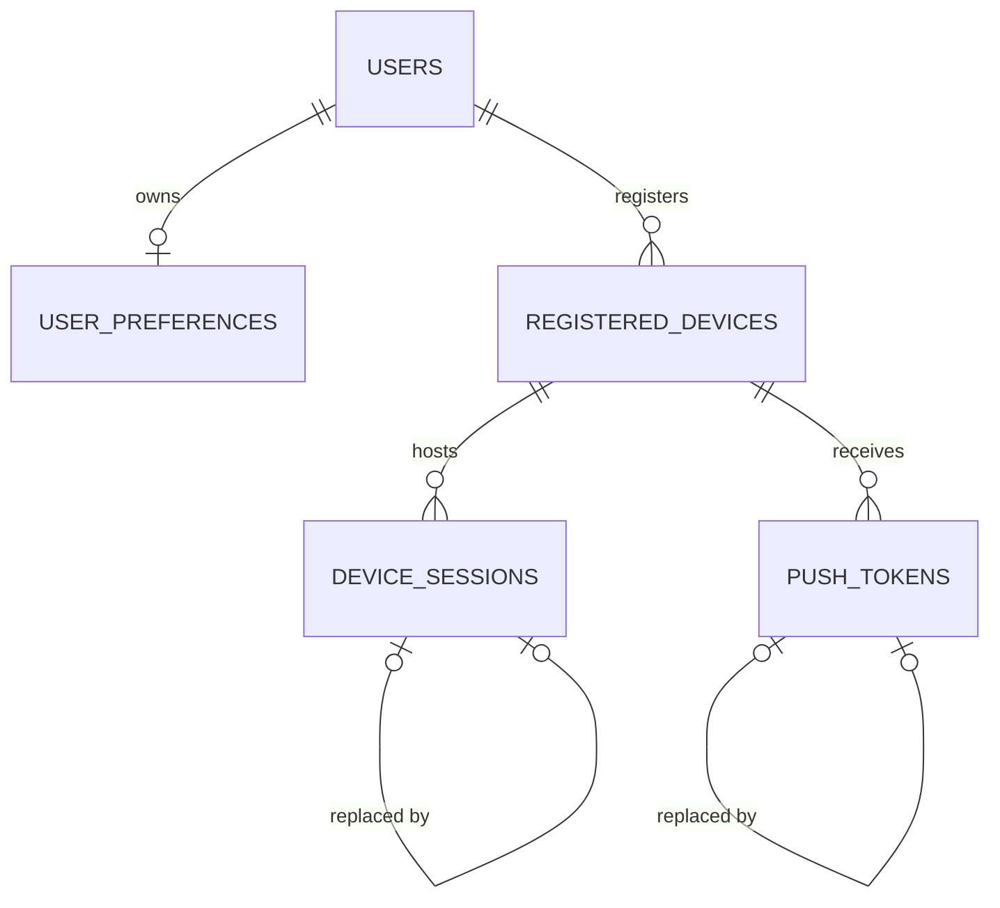

# Stage 3 database schema

This document records the PostgreSQL schema created by Stage 3 issues #37–#64.
It implements the Stage 1 product rules without adding authentication, API,
worker, notification-delivery, upload, or synchronization behavior.

## Authority and storage conventions

- PostgreSQL stores authoritative identity, ownership, lifecycle, and audit data.
- Primary identifiers are application-generated UUIDs; no PostgreSQL extension is
  required for clean installation.
- Instants use timezone-aware timestamps. Local calendar dates and IANA timezone
  names are stored separately where later domain logic requires them.
- State values are stable lowercase strings protected by named checks.
- Record versions and event-sequence allocators are backend-owned positive integers.
- Ordinary deletion must not erase historical or reward-bearing data. Explicit
  foreign-key behavior is listed with each relationship.
- Structured private values are minimized. Database storage does not make a field
  safe for logs or public serialization.

## Identity and device tables

### `users` (#37)

Purpose: authoritative account identity and per-user event-sequence allocation.

- Primary key: `id` UUID.
- Identity: unique `canonical_email`; the database requires lowercase, trimmed,
  nonblank input containing `@`. `display_email` remains separate and trimmed.
- Lifecycle: `account_state` is `active`, `deactivated`, or `deletion_pending`;
  optional lifecycle timestamps preserve later workflow context.
- Integrity: `record_version >= 1`; `next_event_sequence >= 1`.
- Deletion: no child history cascades from ordinary user deletion. The coordinated
  account-erasure workflow remains later work.
- Sensitive classification: account identifier and email are private personal data.
  No password, access token, refresh token, or credential is stored here.

Complete email-address validation and the accepted authentication policy remain
application work. Stage 3 does not choose password rules or token lifetimes.

### `user_preferences` (#38)

Purpose: one authoritative preference snapshot per user.

- Primary key and foreign key: `user_id` → `users.id`; one row per user.
- Timezone: defaults to `UTC`; a shape check excludes abbreviations and fixed
  offsets while allowing IANA-style names. Full timezone-database validation is
  application logic.
- Versioning: positive timezone and record versions plus a server-effective instant.
- Notifications: `unspecified`, `enabled`, or `disabled`; this preference does not
  represent or require OS notification permission.
- Deletion: `ON DELETE CASCADE` because this nonhistorical snapshot has no meaning
  without its user. Coordinated account deletion is still required for the rest of
  the graph.

### `registered_devices` (#39)

Purpose: revocable, auditable application-installation context; never proof of
identity or progression authority.

- Primary key: `id` UUID; immutable `user_id` references `users` with `RESTRICT`.
- Ownership keys: unique `(id, user_id)` and
  `(id, user_id, platform, app_environment)` support composite child references.
- Platform/environment: `android` or `ios`; `development`, `preview`, or
  `production`.
- Lifecycle: `active`, `revoked`, or `removed`, with timestamp consistency checks.
- Active uniqueness: partial unique index on
  `(user_id, app_environment, installation_id)` where state is `active`.
- Query index: `(user_id, device_state, last_seen_at)`.
- Sensitive classification: installation identifiers and version metadata are
  private device metadata. Advertising IDs, IMEI, serial numbers, and hardware IDs
  are not stored.

### `device_sessions` (#40)

Purpose: revocable session metadata associated with the correct user and device;
no token issuance or refresh behavior.

- Primary key: `id` UUID; unique `(id, user_id)` supports replacement history.
- Ownership: composite `(device_id, user_id)` references registered devices with
  `RESTRICT`; a cross-user device/session link is impossible.
- Credential storage: optional opaque binary `credential_digest`; raw access and
  refresh tokens are forbidden.
- Lifecycle: `active`, `revoked`, `expired`, or `replaced`; expiration must follow
  creation and replacement/revocation timestamps must agree with state.
- Replacement: same-user self-reference retains an auditable chain.
- Query indexes: `(user_id, device_id, session_state)` and active expirations.
- Sensitive classification: credential digests, revocation data, and session times
  are private security metadata and must not enter logs or public responses.

Token lifetime, rotation, reuse detection, and maximum-device policy remain blocked
on later accepted authentication decisions.

### `push_tokens` (#41)

Purpose: private, revocable push-provider associations; never progression authority.

- Primary key: `id` UUID; unique `(id, user_id, device_id)` supports auditable
  replacement and later delivery ownership.
- Ownership: `(device_id, user_id, platform, app_environment)` must match one
  registered device; all relationships use `RESTRICT`.
- Providers: `expo`, `fcm`, or `apns`; platform and environment use the registered
  device vocabulary.
- Sensitive value: `token_value` is explicitly marked sensitive in model metadata.
  No encryption infrastructure exists, so Stage 3 does not falsely label it
  encrypted and does not implement homegrown encryption. `token_hash` supports safe
  lookup and active uniqueness.
- Lifecycle: `active`, `invalidated`, or `replaced`, with explicit timestamps and
  replacement linkage.
- Active uniqueness: provider/environment/token hash is globally unique; one active
  provider/environment association exists per user/device.
- Query index: `(user_id, device_id, token_state)`.

Raw push tokens must never appear in logs, model representations, error messages,
notification payload audit, or public API models. Encryption-at-rest integration is
deferred until a repository-approved key-management boundary exists.

## Current entity relationships

## Stage 1 rule mapping

- `domain-model.md`: immutable user ownership and device context boundaries.
- `time-and-timezone.md`: saved IANA timezone snapshots, positive versions, and
  server-effective instants.
- `offline-and-synchronization.md`: registered devices are context only; private
  queued or token values never become authority.
- `history-and-deletion.md`: revocation is state plus audit timestamps; ordinary
  deletion is restricted where security history must remain.
- `mvp-boundary.md`: no authentication, notification delivery, or mobile permission
  behavior is implemented by these tables.

Later Stage 3 branches extend this document with domain, progression, achievement,
notification, evidence, outbox, deletion, and full integrity details.
