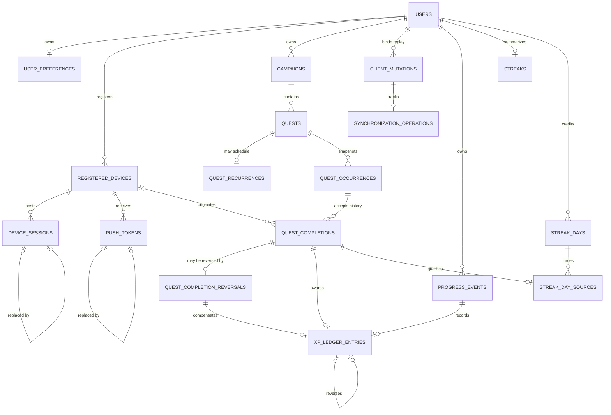

# Stage 3 database schema

This document records the PostgreSQL schema created by Stage 3 issues #37–#64.
It implements the Stage 1 product rules without adding authentication, API,
worker, notification-delivery, upload, or synchronization behavior.

## Authority and storage conventions

- PostgreSQL stores authoritative identity, ownership, lifecycle, and audit data.
- Primary identifiers are application-generated UUIDs; no PostgreSQL extension is
  required for clean installation.
- Instants use timezone-aware timestamps. Local calendar dates and IANA timezone
  names are stored separately where later domain logic requires them.
- State values are stable lowercase strings protected by named checks.
- Record versions and event-sequence allocators are backend-owned positive integers.
- Ordinary deletion must not erase historical or reward-bearing data. Explicit
  foreign-key behavior is listed with each relationship.
- Structured private values are minimized. Database storage does not make a field
  safe for logs or public serialization.

## Identity and device tables

### `users` (#37)

Purpose: authoritative account identity and per-user event-sequence allocation.

- Primary key: `id` UUID.
- Identity: unique `canonical_email`; the database requires lowercase, trimmed,
  nonblank input containing `@`. `display_email` remains separate and trimmed.
- Lifecycle: `account_state` is `active`, `deactivated`, or `deletion_pending`;
  optional lifecycle timestamps preserve later workflow context.
- Integrity: `record_version >= 1`; `next_event_sequence >= 1`.
- Deletion: no child history cascades from ordinary user deletion. The coordinated
  account-erasure workflow remains later work.
- Sensitive classification: account identifier and email are private personal data.
  No password, access token, refresh token, or credential is stored here.

Complete email-address validation and the accepted authentication policy remain
application work. Stage 3 does not choose password rules or token lifetimes.

### `user_preferences` (#38)

Purpose: one authoritative preference snapshot per user.

- Primary key and foreign key: `user_id` → `users.id`; one row per user.
- Timezone: defaults to `UTC`; a shape check excludes abbreviations and fixed
  offsets while allowing IANA-style names. Full timezone-database validation is
  application logic.
- Versioning: positive timezone and record versions plus a server-effective instant.
- Notifications: `unspecified`, `enabled`, or `disabled`; this preference does not
  represent or require OS notification permission.
- Deletion: `ON DELETE CASCADE` because this nonhistorical snapshot has no meaning
  without its user. Coordinated account deletion is still required for the rest of
  the graph.

### `registered_devices` (#39)

Purpose: revocable, auditable application-installation context; never proof of
identity or progression authority.

- Primary key: `id` UUID; immutable `user_id` references `users` with `RESTRICT`.
- Ownership keys: unique `(id, user_id)` and
  `(id, user_id, platform, app_environment)` support composite child references.
- Platform/environment: `android` or `ios`; `development`, `preview`, or
  `production`.
- Lifecycle: `active`, `revoked`, or `removed`, with timestamp consistency checks.
- Active uniqueness: partial unique index on
  `(user_id, app_environment, installation_id)` where state is `active`.
- Query index: `(user_id, device_state, last_seen_at)`.
- Sensitive classification: installation identifiers and version metadata are
  private device metadata. Advertising IDs, IMEI, serial numbers, and hardware IDs
  are not stored.

### `device_sessions` (#40)

Purpose: revocable session metadata associated with the correct user and device;
no token issuance or refresh behavior.

- Primary key: `id` UUID; unique `(id, user_id)` supports replacement history.
- Ownership: composite `(device_id, user_id)` references registered devices with
  `RESTRICT`; a cross-user device/session link is impossible.
- Credential storage: optional opaque binary `credential_digest`; raw access and
  refresh tokens are forbidden.
- Lifecycle: `active`, `revoked`, `expired`, or `replaced`; expiration must follow
  creation and replacement/revocation timestamps must agree with state.
- Replacement: same-user self-reference retains an auditable chain.
- Query indexes: `(user_id, device_id, session_state)` and active expirations.
- Sensitive classification: credential digests, revocation data, and session times
  are private security metadata and must not enter logs or public responses.

Token lifetime, rotation, reuse detection, and maximum-device policy remain blocked
on later accepted authentication decisions.

### `push_tokens` (#41)

Purpose: private, revocable push-provider associations; never progression authority.

- Primary key: `id` UUID; unique `(id, user_id, device_id)` supports auditable
  replacement and later delivery ownership.
- Ownership: `(device_id, user_id, platform, app_environment)` must match one
  registered device; all relationships use `RESTRICT`.
- Providers: `expo`, `fcm`, or `apns`; platform and environment use the registered
  device vocabulary.
- Sensitive value: `token_value` is explicitly marked sensitive in model metadata.
  No encryption infrastructure exists, so Stage 3 does not falsely label it
  encrypted and does not implement homegrown encryption. `token_hash` supports safe
  lookup and active uniqueness.
- Lifecycle: `active`, `invalidated`, or `replaced`, with explicit timestamps and
  replacement linkage.
- Active uniqueness: provider/environment/token hash is globally unique; one active
  provider/environment association exists per user/device.
- Query index: `(user_id, device_id, token_state)`.

Raw push tokens must never appear in logs, model representations, error messages,
notification payload audit, or public API models. Encryption-at-rest integration is
deferred until a repository-approved key-management boundary exists.

## Campaign, quest, occurrence, and completion tables

### `campaigns` (#42)

Purpose: immutable-owner objective and current backend-derived lifecycle snapshot.

- Primary key: `id` UUID; `(id, user_id)` is a composite ownership key.
- Ownership: `user_id` references users with `RESTRICT`.
- Content/order: trimmed nonblank title and nonnegative display order.
- Lifecycle: `active`, `completed`, or `archived`; completed and archived states
  require their authoritative timestamps. Completion reason, archive/restore time,
  record version, and a later-work tombstone are retained.
- Query indexes: active campaigns by user/display order and archived campaigns by
  user/archive time, both as partial indexes.
- Deletion: ordinary product deletion means archive. Relationships to definitions
  and history use `RESTRICT`.

The database cannot decide the campaign-completion predicate. Later transactional
domain logic must derive state and append the corresponding progress event.

### `quests` (#43)

Purpose: immutable campaign-bound one-time or recurring quest definition.

- Primary key: `id` UUID; `(id, user_id, campaign_id, quest_type)` supports owned
  child references and prevents cross-user/cross-campaign attachment.
- Ownership: `(campaign_id, user_id)` references campaigns with `RESTRICT`.
- Type/state: `one_time` or `recurring`; definition state is only `active` or
  `archived`. There is no recurring-definition `completed` value.
- Reward/order: integer `reward_xp >= 0` and nonnegative display order.
- One-time scheduling: optional resolved availability/due instants and timezone;
  recurring definitions cannot populate these columns.
- Lifecycle: archive/restore timestamps, positive record version, and a later-work
  tombstone. Owner and campaign immutability require service-layer update rules.
- Query index: `(user_id, campaign_id, definition_state, display_order)`.
- Evidence: no evidence-required or evidence-validation field exists.

### `quest_recurrences` (#44)

Purpose: exactly one MVP recurrence rule for one recurring definition.

- Primary key: `quest_id`; composite FK includes user, campaign, and the enforced
  `recurring` quest type.
- Grammar: `daily`; `weekly` with a nonempty subset of weekdays 1–7; or `monthly`
  with one day 1–31. No cron, interval, multiple-daily-time, or yearly columns exist.
- Window: inclusive start date; optional inclusive end date or positive maximum
  occurrence count, never both.
- Time: local scheduled time, IANA-shaped timezone, positive rule version, and
  server timestamps.
- Query index: user/timezone/start date supports bounded future generation work.
- Deletion: `RESTRICT`; archive controls generation without deleting the rule.

Full IANA-zone existence, DST resolution, strict weekday de-duplication, and
activation validation remain deterministic backend logic.

### `quest_occurrences` (#45)

Purpose: authoritative per-instance schedule, timezone, rule, and reward snapshot.

- Primary key: `id` UUID; `(id, user_id)` is the completion ownership target.
- Ownership: composite quest/user/campaign/type FK uses `RESTRICT`.
- State: `scheduled`, `available`, `completed`, `reversed`, `expired`, or `voided`,
  with required transition timestamps for historical states.
- Identity: recurring partial unique index on `(quest_id, occurrence_local_date)`;
  one-time partial unique index on `quest_id`.
- Snapshots: authoritative local date, optional local time, IANA timezone,
  timezone-data version, rule version, resolved UTC availability, optional expiry,
  nonnegative reward XP, and generation time.
- Query indexes: scheduled availability, available expiry, user/local-date lookup,
  and quest history.
- Deletion: `RESTRICT`; expired, voided, completed, and reversed rows remain history.

Checks preserve snapshot shape but cannot make those columns immutable or stop a
future occurrence from being completed. Later services must use allowed transitions
and treat snapshot columns as write-once.

### `quest_completions` and `quest_completion_reversals` (#46)

Purpose: retained accepted-completion history plus a separate append-only reversal
event. A reversal never deletes its completion.

- Completion primary key: `id` UUID; composite key includes user and occurrence.
- Ownership: occurrence/user and optional device/user FKs use `RESTRICT`.
- Authority: first server receipt, optional processed time, backend effective local
  date, optional device-observed metadata, client-time validity, and positive event
  sequence are stored separately.
- Active identity: partial unique index on `occurrence_id` where `reversed_at` is
  null. After a transaction records a unique reversal and sets `reversed_at`, a
  fresh completion row may become active while all prior history remains.
- Replay support: optional per-user client mutation is unique within completion or
  reversal history until the global mutation binding is added by #47.
- Reversal: stable UUID, owner, occurrence, unique target completion, optional
  originating device/mutation, nonblank reason, server timestamps, and event
  sequence. All relationships use `RESTRICT`.
- Query indexes: completion effective-date/history and reversal receipt history.
- Sensitive classification: optional device times/timezones are private metadata;
  no evidence, credential, or unrestricted request payload is stored.

The completion row's `reversed_at`, occurrence state transition, reversal insertion,
future XP compensation, and progress event must occur in one transaction. Ordinary
constraints cannot require the matching child reversal while permitting insertion
order, so later service logic and Stage 3 transaction tests cover that invariant.

### `client_mutations` (#47)

Purpose: durable per-user idempotency binding for exact replay.

- UUID primary key; unique `(user_id, client_mutation_id)` and composite ownership
  key `(id, user_id)`.
- Stores canonical payload hash, operation/target identity, explicit processing
  state, canonical result identity, safe error class, and server timestamps.
- Composite FKs bind completion, reversal, progress, and synchronization records to
  the same user. `RESTRICT` preserves replay history.
- A partial unfinished-processing index supports recovery. Payload hashes, not raw
  private payloads, make mutation-ID reuse with different content detectable.

### `synchronization_operations` (#48)

Purpose: auditable retry state for a later synchronization worker.

- UUID primary key; one row per user/client mutation.
- Composite FKs enforce matching user, registered device, and mutation ownership.
- Explicit states distinguish pending, leased, successful, retryable, permanent,
  and cancelled outcomes. Checks enforce nonnegative attempts, in-flight leases,
  successful timestamps, and positive expected versions.
- Partial indexes support due work and stale-lease recovery; no credentials or
  evidence payloads are stored.

### `progress_events` (#49)

Purpose: append-only authoritative progression event log.

- UUID primary key; unique per-user event sequence and stable
  `(user, event type, source type, source id)` identity.
- Optional mutation binding is ownership-safe. Server receipt/processing times,
  backend effective date, rule version, and object-shaped safe JSON metadata are
  retained.
- The unique user-sequence index and source index support ordered replay and
  provenance lookup.
  Arbitrary client-authored events and secret rule bodies are application-forbidden.

### `xp_ledger_entries` (#50)

Purpose: immutable XP awards and exact compensating reversals.

- UUID primary key; composite ownership FKs bind the user to a completion or
  reversal, progress event/sequence, optional mutation, and source award.
- Award rows require nonnegative XP and a completion. Compensation rows require a
  reversal and exactly negate the referenced award amount; the composite self-FK
  proves that amount matches the retained source row.
- Partial unique indexes permit one award per completion and one compensation per
  reversal/source award. Progress event and user sequence are also unique.
- Zero-XP awards are valid. Authoritative XP is `sum(xp_delta)`. Preventing a
  negative aggregate total requires locking and validation in the future domain
  transaction because ordinary row checks cannot constrain a cross-row sum.

### `level_definitions` (#51)

Purpose: backend-owned, versioned level-curve thresholds.

- Composite primary key `(curve_version, level_number)`; thresholds are unique per
  curve. Versions and levels are positive, thresholds nonnegative, and level 1 is 0.
- Explicit draft/active/retired state and timestamps preserve activation history.
- Before activation, backend transaction logic must verify levels are contiguous
  from 1 and thresholds strictly increase (using ordered `lag`/row-number
  validation). Active curves are application-immutable. No product thresholds are
  seeded by Stage 3.

### `streaks`, `streak_days`, and `streak_day_sources` (#52)

Purpose: reconstructable user-global daily streaks with a derived summary.

- `streaks` is one row per user with nonnegative current/longest values, a last
  qualifying date, calculation watermark, and record version.
- `streak_days` has UUID identity plus unique `(user_id, effective_local_date)`.
  It snapshots server-derived date, IANA timezone and preference version. Credited
  days require at least one source; removed days retain their timestamps and row.
- `streak_day_sources` binds each completion, user, and effective date to its day;
  a unique completion source prevents duplicate credit. Optional reversal ownership
  and state preserve removal history.
- The unique user/date index and day/state index support recalculation. Multiple completions can
  share one day, including zero-XP completions. Reversing one source leaves the day
  credited while another active source remains. Source counts and summary values
  must change with source state in one future backend transaction.

## Current entity relationships

## Stage 1 rule mapping

- `domain-model.md`: immutable user ownership and device context boundaries.
- `time-and-timezone.md`: saved IANA timezone snapshots, positive versions, and
  server-effective instants.
- `offline-and-synchronization.md`: registered devices are context only; private
  queued or token values never become authority.
- `history-and-deletion.md`: revocation is state plus audit timestamps; ordinary
  deletion is restricted where security history must remain.
- `mvp-boundary.md`: no authentication, notification delivery, or mobile permission
  behavior is implemented by these tables.

Later Stage 3 branches extend this document with domain, progression, achievement,
notification, evidence, outbox, deletion, and full integrity details.
